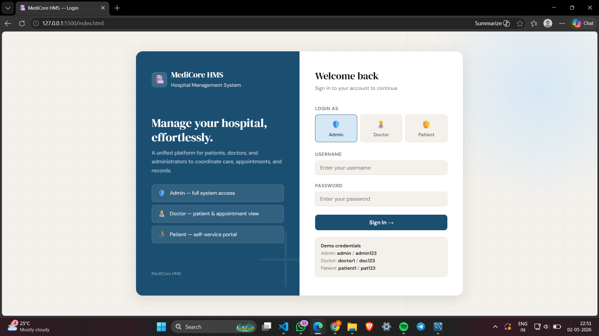
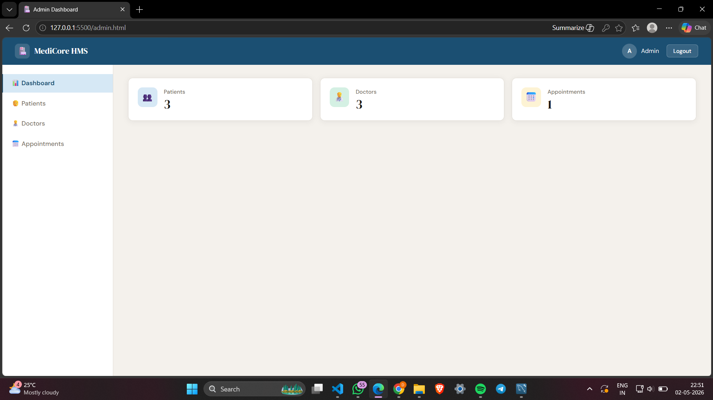
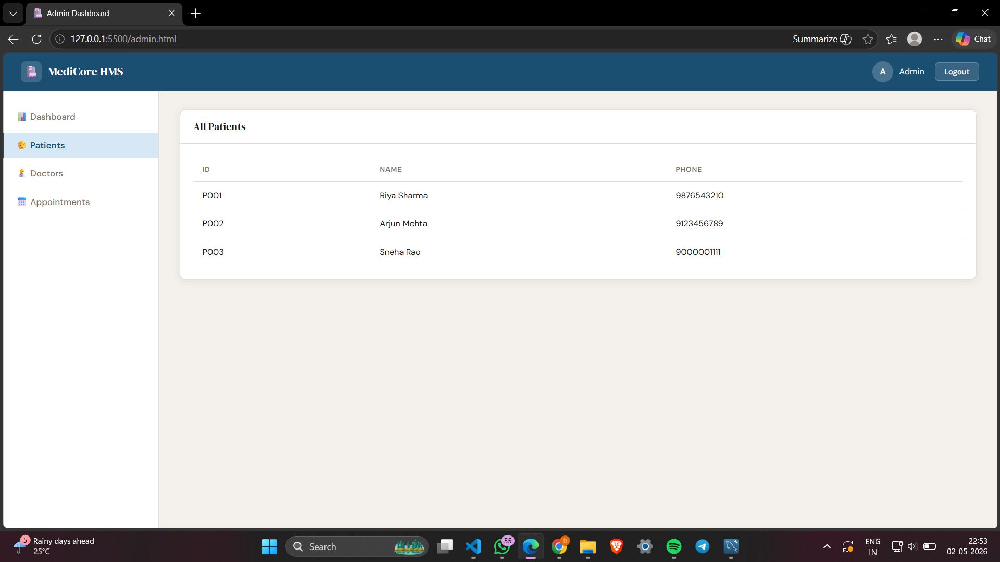
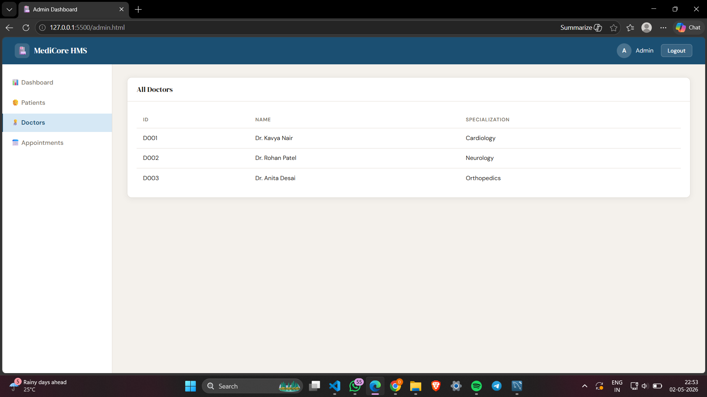
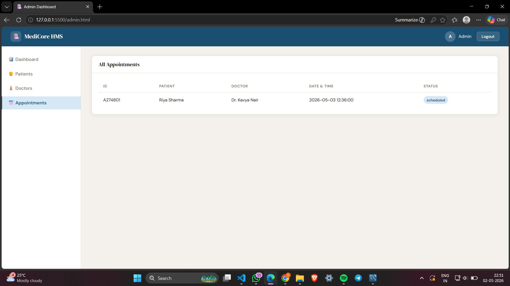
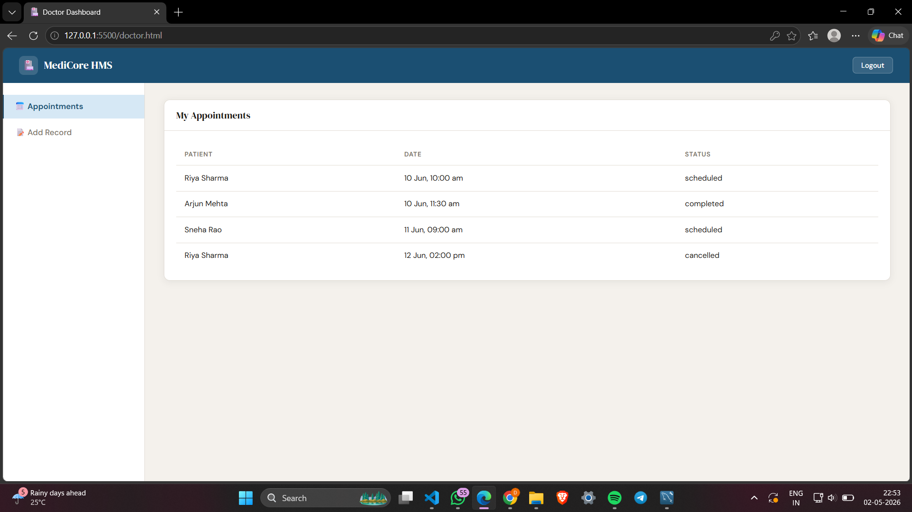
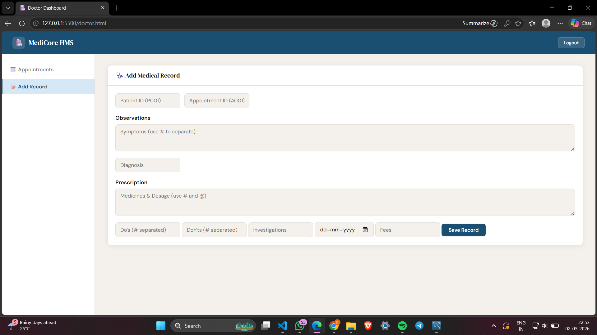
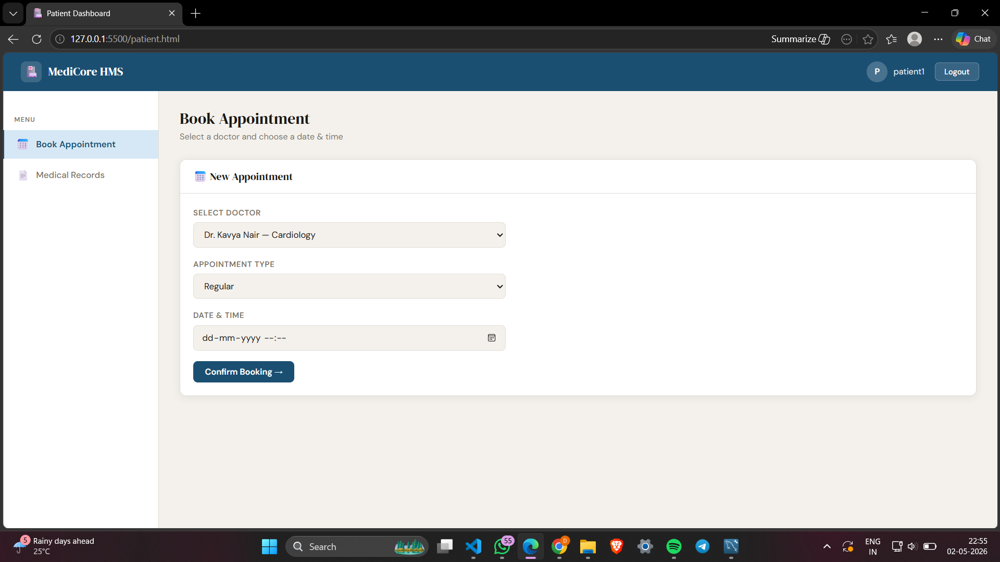
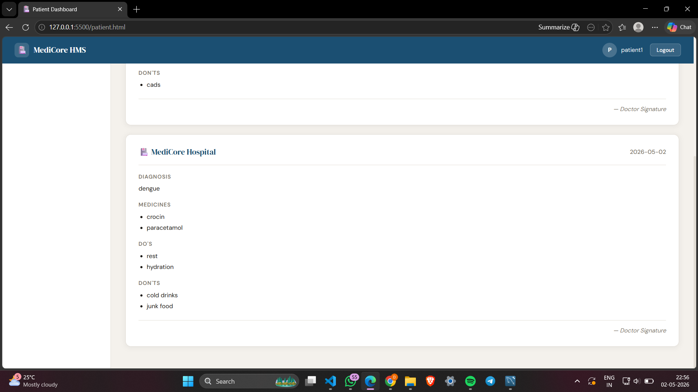

# 🏥 MediCore HMS — Hospital Management System

> A full-stack, database-driven Hospital Management System built as a DBMS college project.  
> Manages patients, doctors, appointments, medical records, and billing through a role-based web interface.



---

## 📋 Table of Contents
- [About the Project](#about-the-project)
- [Tech Stack](#tech-stack)
- [System Architecture](#system-architecture)
- [Role-Based Access](#role-based-access)
- [Features](#features)
- [Database Schema](#database-schema)
- [Screenshots](#screenshots)
- [Setup Instructions](#setup-instructions)
- [Project Structure](#project-structure)
- [Key Implementation Details](#key-implementation-details)

---

## 📌 About the Project

MediCore HMS is a three-tier hospital management application that simulates real hospital operations.  
It was built to demonstrate practical application of relational database concepts including:

- Schema design and normalization (3NF)
- Foreign key constraints and referential integrity
- Prepared statements and SQL injection prevention
- Transaction handling and conflict detection
- Role-based access control

The system supports three user roles — **Admin**, **Doctor**, and **Patient** — each with a dedicated dashboard and controlled access to specific functionality.

---

## 🛠 Tech Stack

| Layer | Technology | Purpose |
|-------|-----------|---------|
| Database | MySQL 8.0 | Data storage, constraints, relationships |
| Backend | Java (Core + JDBC) | Business logic, SQL execution |
| HTTP Server | com.sun.net.httpserver | Lightweight built-in Java HTTP server |
| Frontend | HTML5 + CSS3 | UI layout, styling, responsive design |
| Scripting | Vanilla JavaScript | Fetch API, DOM manipulation, session handling |
| DB Driver | MySQL Connector/J | JDBC bridge between Java and MySQL |

---

## 🏗 System Architecture
┌─────────────────────────────────────────────────────┐
│                  PRESENTATION TIER                   │
│   index.html  admin.html  doctor.html  patient.html  │
│              style.css    script.js                  │
└────────────────────┬────────────────────────────────┘
│  HTTP (Fetch API)
│  POST/GET — URL encoded
▼
┌─────────────────────────────────────────────────────┐
│                   LOGIC TIER                         │
│   MainServer.java  (port 8000)                       │
│   ├── /login        → UserDAO                        │
│   ├── /book         → AppointmentDAO                 │
│   ├── /addRecord    → MedicalRecordDAO               │
│   ├── /getRecords   → MedicalRecordDAO               │
│   └── /getAppointments → Direct JDBC                 │
└────────────────────┬────────────────────────────────┘
│  JDBC (PreparedStatement)
▼
┌─────────────────────────────────────────────────────┐
│                    DATA TIER                         │
│   MySQL — hospital_db                                │
│   users · patients · doctors · appointments          │
│   medical_records · billing                          │
└─────────────────────────────────────────────────────┘

---

## 👥 Role-Based Access
                    ┌─────────────┐
                    │  LOGIN PAGE │
                    └──────┬──────┘
                           │ authenticate via MySQL
           ┌───────────────┼───────────────┐
           ▼               ▼               ▼
    ┌─────────────┐ ┌───────────────┐ ┌──────────────┐
    │    ADMIN    │ │    DOCTOR     │ │   PATIENT    │
    └──────┬──────┘ └───────┬───────┘ └──────┬───────┘
           │                │                 │
    ┌──────▼──────┐  ┌──────▼──────┐  ┌──────▼──────┐
    │ • Dashboard │  │ •Appointments│  │ • Book Appt │
    │ • Patients  │  │ • Add Record │  │ • My Records│
    │ • Doctors   │  └─────────────┘  └─────────────┘
    │ • All Appts │
    └─────────────┘

---

## ✨ Features

### 🛡️ Admin
- Live dashboard with appointment count fetched from MySQL
- View all registered patients and doctors
- View all appointments with color-coded status badges (Scheduled / Completed / Cancelled)

### 👨‍⚕️ Doctor
- View all scheduled appointments
- Add structured medical records with:
  - Diagnosis
  - Medicines (# separated)
  - Do's and Don'ts
  - Investigations and follow-up date
  - Consultation fees

### 🧑 Patient
- Book appointments with doctor and time slot selection
- **Double-booking prevention** — system rejects if doctor already has an appointment at the chosen time
- View all past medical records displayed as formatted prescription cards

### 🔐 All Roles
- Secure login with role validation
- Session management via `sessionStorage`
- Automatic redirect if session is missing or role mismatches
- Toast notifications for all actions (success / error)

---

## 🗄 Database Schema

```sql
hospital_db
├── users           (user_id PK, username, password_hash, role ENUM)
├── patients        (patient_id PK, user_id FK, name, dob, gender, blood_group, phone, address, doctor_id FK)
├── doctors         (doctor_id PK, user_id FK, name, specialization, phone, available_days)
├── appointments    (appt_id PK, patient_id FK, doctor_id FK, appt_datetime DATETIME, status ENUM, type ENUM)
├── medical_records (record_id PK, patient_id FK, doctor_id FK, appt_id FK, diagnosis, prescription, notes, created_at)
└── billing         (bill_id PK, patient_id FK, appt_id FK, amount, payment_status ENUM, generated_at)
```

All tables are in **Third Normal Form (3NF)**.  
Foreign keys enforce referential integrity across all related tables.

---

## 📸 Screenshots

### Login Page


### Admin Dashboard





### Doctor Dashboard



### Patient Dashboard



---

## ⚙️ Setup Instructions

### Prerequisites
- JDK 17 or higher
- MySQL 8.0
- MySQL Workbench
- VS Code (or any browser for frontend)

### 1. Database Setup
Open MySQL Workbench and run these files in order:
```sql
-- Step 1: creates hospital_db and all 6 tables
source database/schema.sql

-- Step 2: inserts default admin, doctor, patient users
source database/seed.sql
```

### 2. Configure DB Connection
Open `src/db/DBConnection.java` and update:
```java
private static final String URL  = "jdbc:mysql://localhost:3306/hospital_db";
private static final String USER = "root";       // your MySQL username
private static final String PASS = "yourpassword"; // your MySQL password
```

### 3. Add MySQL Connector
- Download `mysql-connector-j-x.x.x.jar` from [MySQL Downloads](https://dev.mysql.com/downloads/connector/j/)
- Place it in the `lib/` folder

### 4. Compile and Run Java Server
```bash
# Windows
javac -cp lib/mysql-connector-j.jar src/**/*.java -d out/
java -cp "lib/mysql-connector-j.jar;out" server.MainServer

# Mac/Linux
javac -cp lib/mysql-connector-j.jar src/**/*.java -d out/
java -cp "lib/mysql-connector-j.jar:out" server.MainServer
```

Server starts at `http://localhost:8000`

### 5. Open Frontend
- Open `web/index.html` using VS Code Live Server (runs on port 5500)
- Or open directly in browser

### 6. Login Credentials
| Role | Username | Password |
|------|----------|----------|
| Admin | `admin` | `admin123` |
| Doctor | `doctor1` | `doc123` |
| Patient | `patient1` | `pat123` |

---

## 📁 Project Structure
HospitalMS/
├── src/
│   ├── server/
│   │   └── MainServer.java       # HTTP server, all endpoints
│   ├── dao/
│   │   ├── UserDAO.java          # Authentication queries
│   │   ├── AppointmentDAO.java   # Booking + conflict check
│   │   └── MedicalRecordDAO.java # Record insert + fetch
│   └── db/
│       └── DBConnection.java     # JDBC connection singleton
├── web/
│   ├── index.html                # Login page
│   ├── admin.html                # Admin dashboard
│   ├── doctor.html               # Doctor dashboard
│   ├── patient.html              # Patient dashboard
│   ├── style.css                 # Shared stylesheet
│   └── script.js                 # Shared JS utilities + mock DB
├── database/
│   ├── schema.sql                # CREATE TABLE statements
│   └── seed.sql                  # INSERT default data
├── screenshots/                  # UI screenshots for README
├── lib/                          # MySQL JDBC connector JAR (add manually)
└── README.md

---

## 🔍 Key Implementation Details

**Double Booking Prevention**  
Before every appointment insert, a SELECT query checks for an existing non-cancelled appointment with the same `doctor_id` and `appt_datetime`. The Java backend returns `"conflict"` and the frontend shows an error toast — no insert is attempted.

**SQL Injection Prevention**  
Every database query uses `PreparedStatement` with `?` placeholders. No string concatenation is used in SQL queries anywhere in the codebase.

**URL Encoding**  
Prescription data contains special characters (`#`, `\n`, `:`). All POST body values are encoded with `encodeURIComponent()` on the frontend and decoded with `URLDecoder.decode()` in Java before processing.

**Session Management**  
After login, `{ username, role }` is stored in `sessionStorage`. Every dashboard page calls `requireLogin(expectedRole)` on load — if the session is missing or the role doesn't match, the user is redirected to the login page immediately.

---